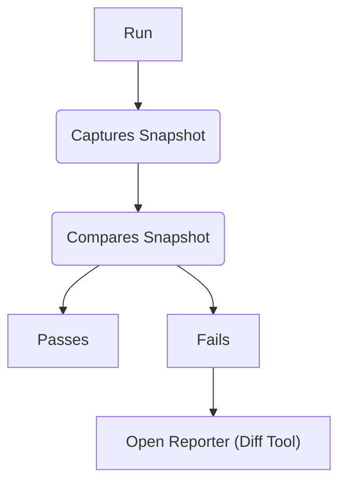
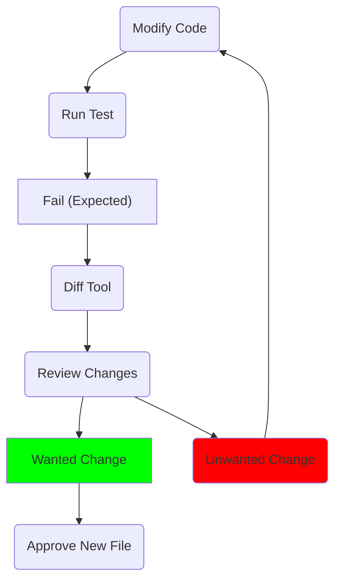
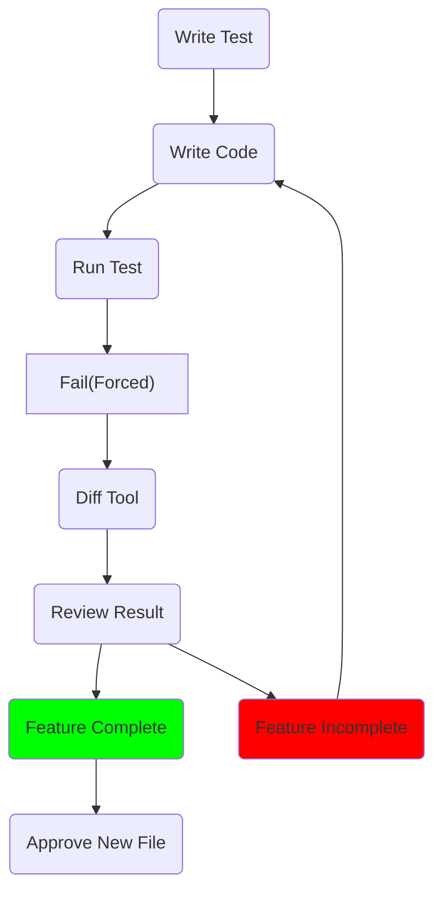
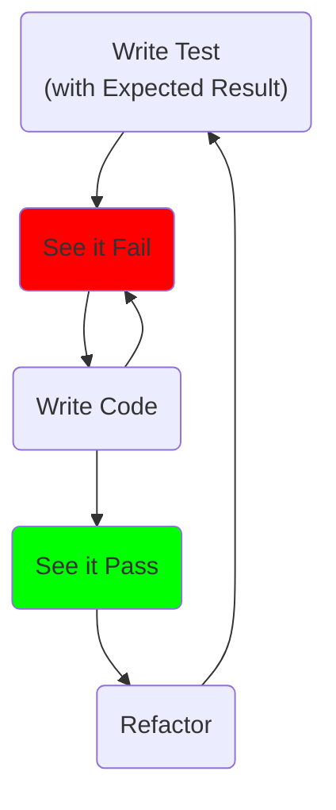
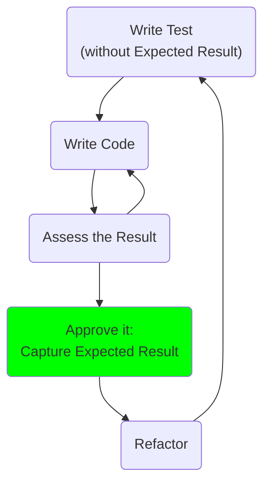

# Approval Testing Concepts

toc

For Intention Only:
Diagram representing the workflow of a dev using approval tests
The user will have tasks
User tasks / actions
User sees

## Developer Workflow
digraph G { node [style=filled, shape=rect]

* Separate steps with user vs automatic

User would do:
- approvaltests already installed
- user does: write new test -> run the test

## Running Approvals

## Add Behavior to Existing Approval
If you are fixing a bug (or adding a feature), this will change the expected behavior. Therefore when you run the test, it will fail.

## New Approval
Because the `.approved` file does not exist when writing a new test, the test will always fail the first time you run it.

## TDD and ApprovalTests

### TDD using Asserts
Test Driven Development usually follows this path:

### TDD using ApprovalTests
The ApprovalTests loop is slightly different than traditional TDD.
It splits the writing of the test into 2 parts:
1. Writing the Test 
1. Capturing the Expected Result

And moves the capturing of the expected result to after the code is written.

### TDD 

<extra notes here>

## Tactics

### Approving Files

Copying from the recieved into the appproved. This can be done on the file system or directly in the diff tool.

"Expected Failure"  -> {"failure2", "Pass (unexpected)"} 
GOAL:  capture the Expected result
use Approval Tests to KEEP TRACK of passing tests

