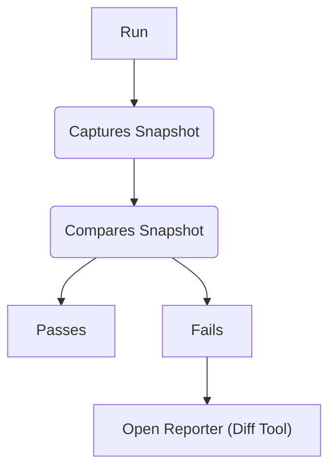
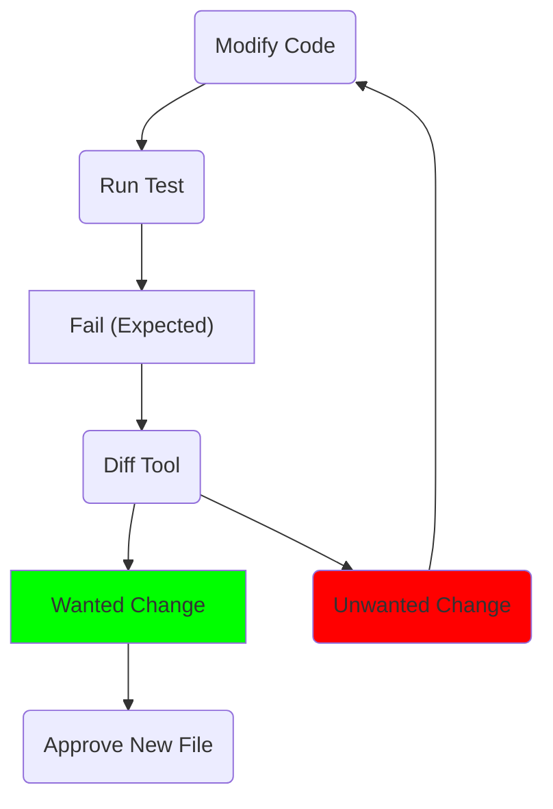
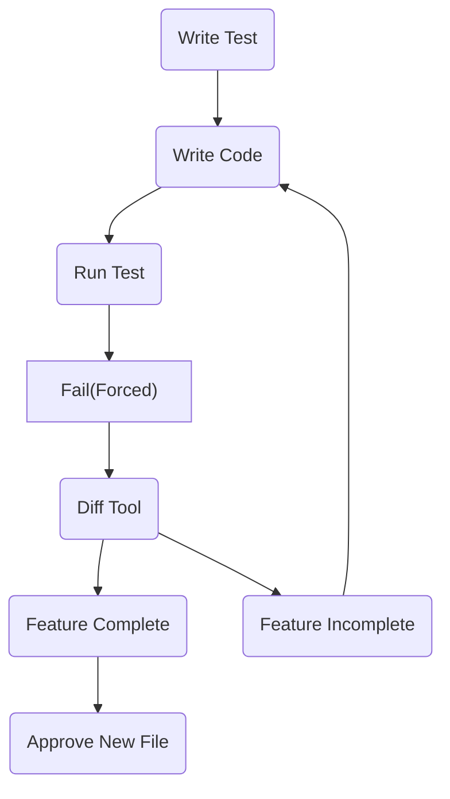

# Approval Testing Concepts

<!-- toc -->
## Contents

  * [Developer Workflow](#developer-workflow)
  * [TDD](#tdd)
  * [Tactics](#tactics)
    * [Approving Files](#approving-files)<!-- endToc -->

For Intention Only:
Diagram representing the workflow of a dev using approval tests
The user will have tasks
User tasks / actions
User sees

## Developer Workflow
digraph G { node [style=filled, shape=rect]

* Separate steps with user vs automatic

User would do:
- approvaltests already installed
- user does: write new test -> run the test

## Running Approvals

## Add Behavior to Existing Approval

## New Approval

## TDD 

Test Driven Development usually follow the path 

1. Write Arange/Act/Assert Test
1. See it fail
1. Write Code
1. See it pass

Approvaltests loop is slightly different.

It splits the writing of the test into 2 parts:
1. Write Arange/Act part
1. Do the Assert part (Approve it)

These part get seperated to create the full cycle
1. Write Arange/Act
1. See it fail
1. Write Code
1. See it produce the desired output
1. Approve it
1. See it pass

## Tactics

### Approving Files

Coping from the recieved into the appproved. This can be done on the file system or directly in the diff tool.

"Expected Failure"  -> {"failure2", "Pass (unexpected)"} 
GOAL:  capture the Expected result
use Approval Tests to KEEP TRACK of passing tests

