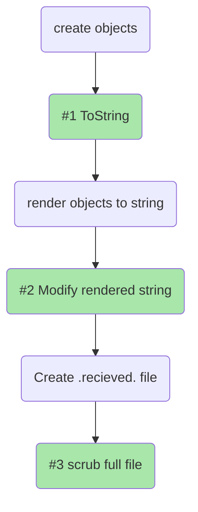
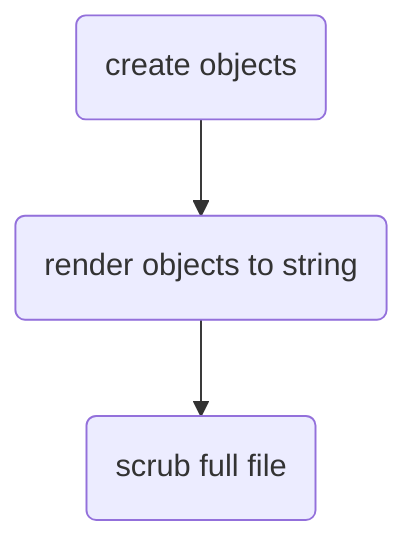

# Creating Disired Output

## Inserting Points
The Places you can modify the rendering of an `.approved.` file is as follows



## The steps

The Process of generating an `.approved.` file is as follows


There are multiple places you can effect the final output. Often people forget they have these choices and feel trapped.

## Place 1 - To ToString

Let's say you have an object 

```json
{
  "first_name" : "Llewellyn"
  "last_name" :"Falco"
  "age" : "infinite"
}
```
The default ToString rendering will look as above, but you don't want that, you want it to look like 
```txt
L. Falco 
```
no problem, create a method `myCustomString(person)` and do what you want.

## Place 2 - Modify the Individually Rendered objects

If you have to deal with a rendered string, you can always modify it again. Note that you can use the scrubber directly to do this.
For example:
```python
verify_all("stuff", my_array, lambda e: scrubber(get_logs_for(e)))
```
Will scrub the logs indivually, instead of the combined results

## Place 3 - Scrub the full resulting file

After all is said and done, there is still the final step of scrubbing which apply to the full `.approved.` file.

Find out more about [scrubbers here](../reference/scrubbers.md)


