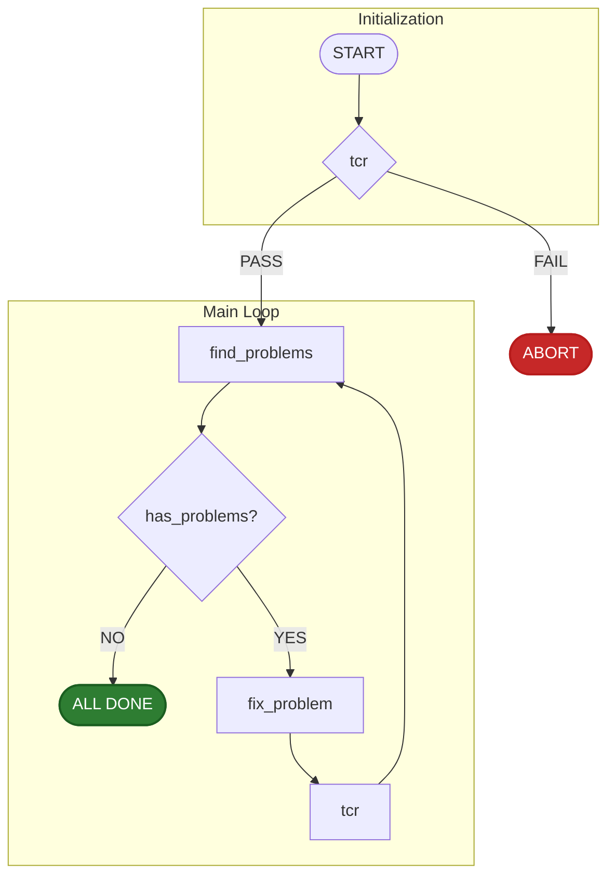

# AI-Powered Loop Fixer

This is a Python script that automates the process of detecting and fixing of issues within a codebase. It operates in a loop, continuously identifying problems, attempting fixes using an AI model, verifying the changes, and committing them upon success.

## Table of Contents

- [Overview](#overview)
- [Workflow Diagram](#workflow-diagram)
- [Core Scripts](#core-scripts)

## Overview

The main goal of the AI Fixer Loop is to maintain code quality by automating repetitive fixing tasks. It starts by running an initial check to ensure a stable baseline. If the check passes, it scans for problems. When a problem is found, it invokes an AI to generate a fix. The fix is then passed to the `tcr` script, which tests the changes, and then either commits them if they pass or reverts them if they fail. The loop continues until no more problems are found.

## Workflow Diagram

The following diagram illustrates the execution flow of the AI Fixer Loop script.



## Core Scripts

The Delinter relies on a set of scripts located alongside the main Python script. These scripts should be executed from the repository's base directory.

- `find_problems`: Scans the codebase and identifies issues to be fixed. return code 0 means we have problems.
- `fix_problem`: Calls the AI model to generate a fix for an identified problem. return code means nothing.
- `tcr`: (Test && Commit || Revert) Verifies that the latest changes have not broken the build or tests. If the build is working, it commits the changes. Otherwise, it reverts them. return code 0 means it committed.

On Windows, these scripts are `.cmd` files. On Linux/macOS, they are shell scripts without an extension. You can run them from the command line like this the same way, if you use a shell:
```bash
./find_problems
```
## Preventing Infinite Loops

The script will run a max of 1000 times. 


## Parameters

There are optional parameters for:
- `--find FIND_SCRIPT`: The script to run to find problems. Default is `find_problems`.
- `--fix FIX_SCRIPT`: The script to run to fix problems. Default is `fix_problem`.
- `--tcr TCR_SCRIPT`: The script that checks if the fix worked and either commits or reverts. Default is `tcr`.

## sample output
time stamps show how long external scripts took. 
```
✅ build working
Run #1 
✅ found problems [0:21]
✅ fix problem [0:22]
✅ tcr: committed [0:23]
-----------------------------
Run #2 
✅ found problems [0:21]
✅ fix problem [0:22]
❌ tcr: reverted [0:23]
-----------------------------
Run #3 
✅ found problems [0:21]
✅ fix problem [0:22]
✅ tcr: committed [0:23]
----------------------------
Run #4  
no more problems found.
```

## testing

To test the AI fixer loop and reproduce the sample output, you can use the following scripts. They coordinate by writing to a shared `.ignore/count.txt` file.

- **`test_find`**: Finds problems and increments the counter in `.ignore/count.txt` until it reaches `4`.
- **`test_fix`**: This script does nothing.
- **`test_tcr`**:
    - **Passes** if the counter is `1` or `3`.
    - **Fails** if the counter is `2`.
    - **Resets** the counter to `0` if it is `4`.