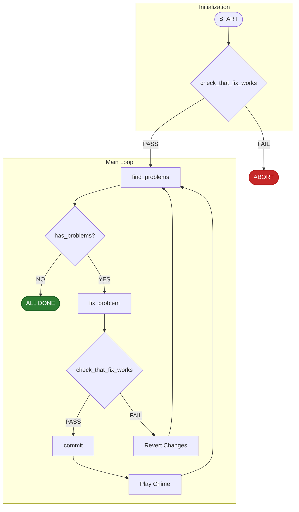

# AI-Powered Loop Fixer

This is a Python script that automates the process of detecting and fixing of issues within a codebase. It operates in a loop, continuously identifying problems, attempting fixes using an AI model, verifying the changes, and committing them upon success.

## Table of Contents

- [Overview](#overview)
- [Workflow Diagram](#workflow-diagram)
- [Core Scripts](#core-scripts)
- [Key Operations](#key-operations)
  - [Git Revert](#git-revert)
  - [Chime Notification](#chime-notification)

## Overview

The main goal of the AI Fixer Loop is to maintain code quality by automating repetitive fixing tasks. It starts by running tests to ensure a stable baseline. If the tests pass, it scans for problems. When a problem is found, it invokes an AI to generate a fix. The fix is then tested. If the tests pass, the changes are committed, and the loop continues. If the tests fail, the changes are reverted, and the script moves on to the next problem.

## Workflow Diagram

The following diagram illustrates the execution flow of the AI Fixer Loop script.



## Core Scripts

The Delinter relies on a set of scripts located alongside the main Python script. These scripts should be executed from the repository's base directory.

- `check_that_fix_works`: Verifies that the latest changes have not broken the build or tests.
- `find_problems`: Scans the codebase and identifies issues to be fixed.
- `fix_problem`: Calls the AI model to generate a fix for an identified problem.
- `commit`: Commits the verified changes to the Git repository.

On Windows, these scripts are `.cmd` files. On Linux/macOS, they are shell scripts without an extension. You can run them from the command line like this the same way:
```bash
./find_problems
```

## Key Operations

### Git Revert
If a fix proposed by the AI fails the `check_that_fix_works` step, the script will revert the changes using `git reset --hard` to ensure the codebase remains in a valid state before proceeding.

### Chime Notification
After each successful iteration (i.e., a successful commit), the script plays a system chime sound to provide an audible notification that a fix has been completed. The sound is `Glass.aiff` on macOS. On Windows, the `SystemAsterisk` sound can be played using the `winsound` module.

Example for Windows:
```python
import winsound

# Play the 'Asterisk' system sound
winsound.PlaySound('SystemAsterisk', winsound.SND_ALIAS)
```
