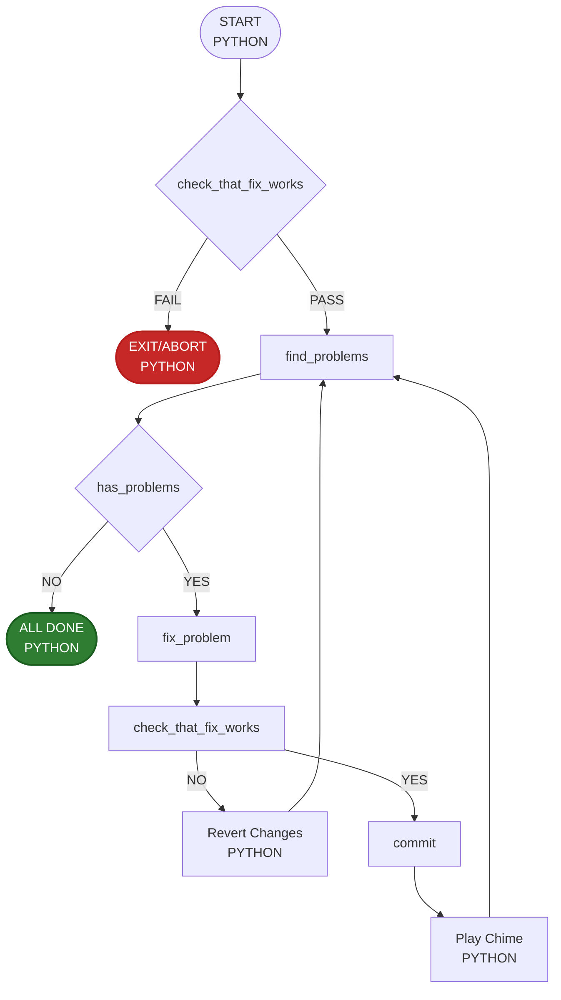

# AI Loop Fixer

This is a python script 
Detects an issue and tries to fix it in a loop.



## Scripts

The scripts are along side the python script, but all run from the repos base directory.

* check_that_fix_works
* find_problems
* fix_problems
* commit

on windows the scripts are .cmd files, on linux they are .sh files without an extension. This means you can run them from the command line like this:

```
./find_problems
```

## Git revert
`git reset --hard`

### Chime

After each successful iteration (commit), the script plays a system chime sound (Glass.aiff on macOS) (?? on windows) to notify that the iteration is complete.
